# Aviation Wiki 项目汇报

## 项目内容

🔴未开始   🟡进行中   🟢已完成
- 🟢页面设计
  - 🟢底层界面设计
  - 🟢侧边栏设计
  - 🟢博客界面设计
  - 🟢网站首页样貌提升工程
  - 🟢用户登录界面
- 🟢词条
  - 🟢Boeing
  - 🟢Airbus
  - 🟢中国商飞
  - 🟢Airport
- 🟡其他内容
  - 🟢亮暗色模式切换
  - 🟢暗色模式适配
  - 🟢图片轮播
  - 🟢图片下载
  - 🟢机场界面改为可滚动
  - 🟢机场界面添加交通信息和地图
  - 🟢Wiki界面表格样式优化
  - 🔴移动端视图适配
- 🟡论坛相关内容
  - 🟢用户注册、登录操作
  - 🟢用户界面
  - 🟡数据库搭建
  - 🔴发帖与删除
  - 🔴评论与删除
  - 🟢私信功能演示
- 🟡成果展示
  - 🟡最终汇报文档
  - 🟡网页使用文档
  - 🟢预研展示内容（样板房）
- 🔴远期规划
  - 🔴连接服务器
  - 🔴Wiki页面编辑
  - 🔴更多文字内容和图片
  - 🔴根据用户是否在中国选择相应视频/地图服务
  - 🔴多语言网页

当前进度（近期计划）：**46%**

## 为什么选择这个项目

我本人平时喜欢出去玩。最近一个学期经常搭乘国铁去长三角其他城市旅游。在搭车时我想查询我搭乘列车的一些信息，无意间发现一个网站 www.china-emu.cn 。这个网站图片清晰，功能完善，视觉效果极强。既然“地上跑的”已经有了，那么我们就做一个“天上飞的”。于是，Aviation Wiki就诞生了。然而人家的网站已经有11年的历史了，而我们只有11天的开发时间，两者肯定没法比。

## 项目内容介绍

我们的项目共有6个模块：

- 首页
- 波音
- 空中客车
- 中国商飞
- 机场
- 讨论区

### 首页

首页展示了多个卡片。前几个卡片指向各个页面链接。下方展示热门机型和机场，远期根据服务器端的点阅量数据进行展示，近期只做静态展示。首页顶部是用JavaScript编写的小动画。首页底部滚动播放的是本人在2025年3月于虹桥国际机场拍摄的一些飞机图片。主页背景和子页面不同，采用蓝色主题。首页侧边栏默认处于收折状态。

### 波音

本模块介绍波音的几款民用飞机，包括其简介、重要日期、参数、图片等。每种机型都放了相关YouTube视频供大家查看。在一些机型中还加入了大家关心的内容，比如安全性争议和几场空难简介。

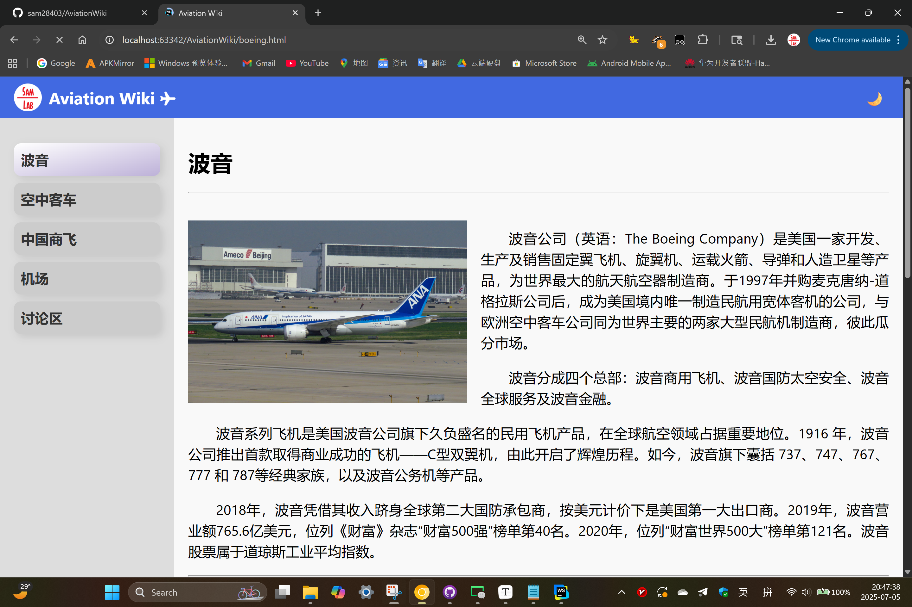

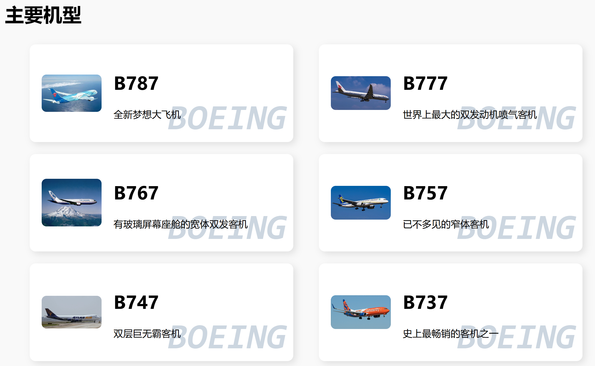

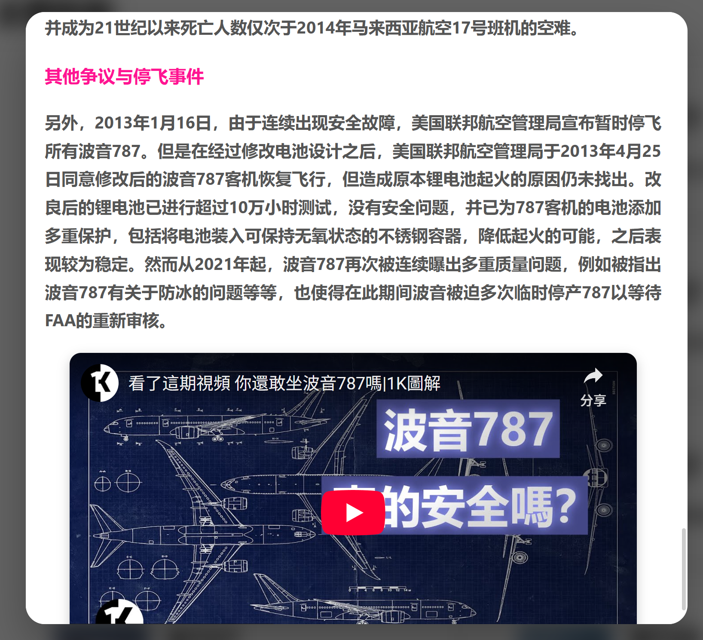

### 空中客车

空中客车界面与波音类似，均有详细的介绍、参数、图片、视频。

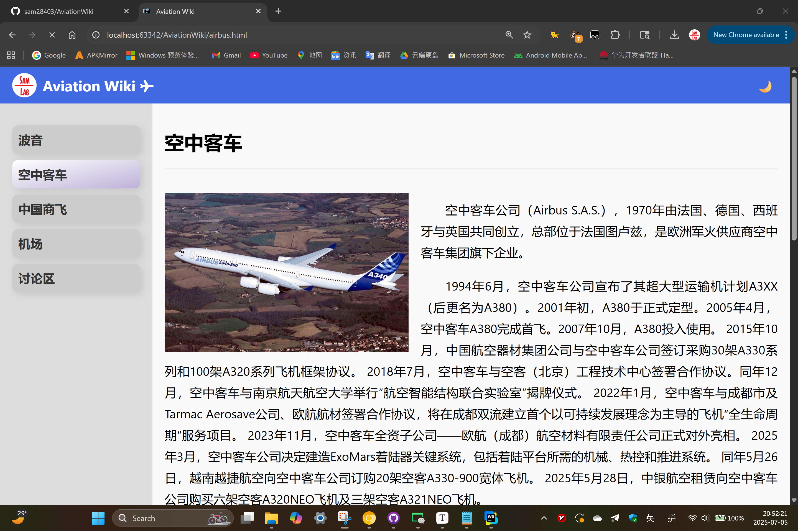

### 中国商飞

本界面介绍了中国主导研发制造的飞机。由于飞机数量较少且本页面制作人和前两个页面制作并未采用同一套设计逻辑，故此页面设计于前两个不同。

本页面采用4组卡片简介各个机型的概况。下方用文字详细描述。当然，参数页面是必不可少的。由于中国飞机刚起步且交货量与购买商较少，本页面详细展示了两款飞机的交付情况。另外，每款飞机底部还展示了该机型的轮播图片。这两款飞机我都没有搭乘过，照片来自网路。

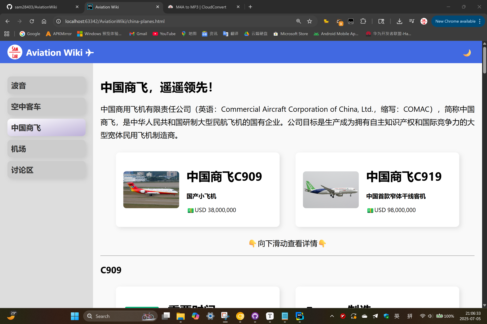

### 机场

本界面介绍了上海及周边省份（沪苏浙皖）共8个机场（每个省2个）。远期将拓展至中国（仅CN）地区。点击卡片可以显示机场照片一张与简介。下拉可以看到小地图，通过链接可以跳转至OpenStreetMap进行导航。地图下方是机场的轨道交通信息（如果有）。远期将加入公交信息。

### 讨论区

目前此界面仍在开发中。设计参考一位开发者的个人网站。完成后左侧导航栏将放置个人信息和注册/登录按钮，中间放置贴文，右边放置热门话题。

### 个人中心

目前此界面仍在开发中。后续在未登录情况下点击个人中心会跳转至登录界面。

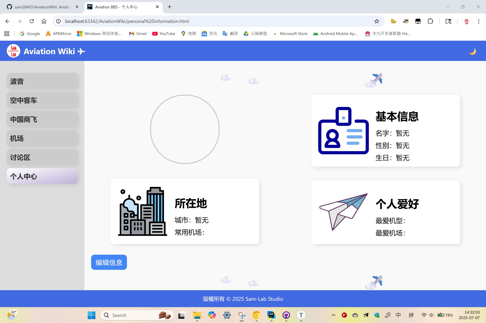

### 登录/注册页面

采用简洁设计，单一卡片。登录设置账户、密码、验证码。

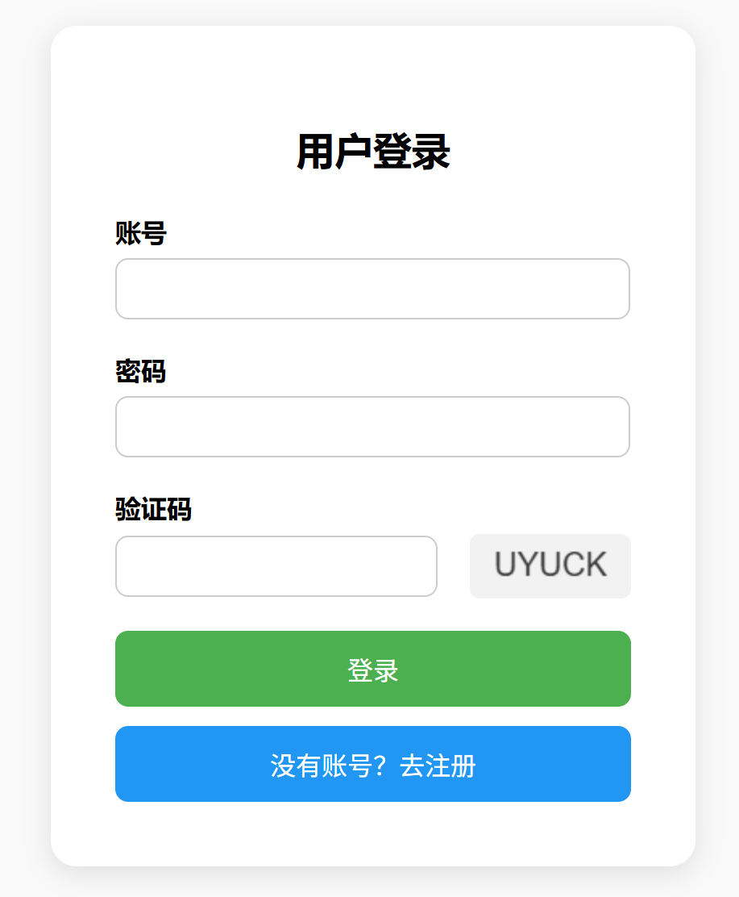

在非法输入、验证码错误、两次密码输入不同时会有警告（原生样式）。

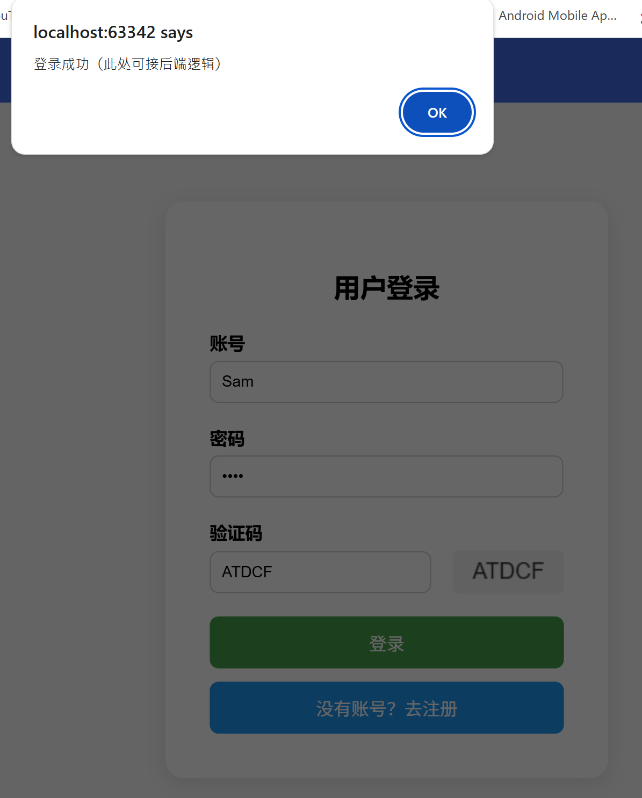

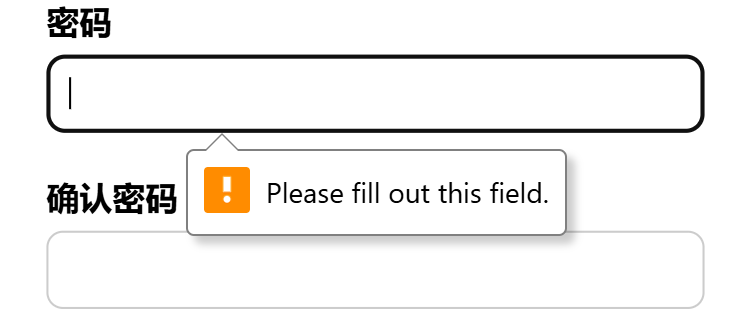

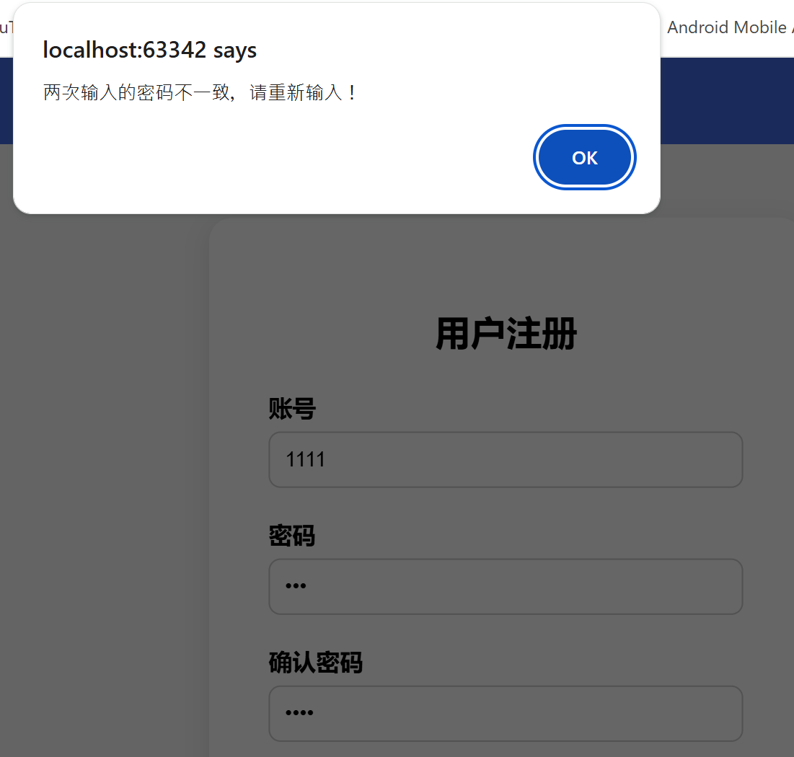

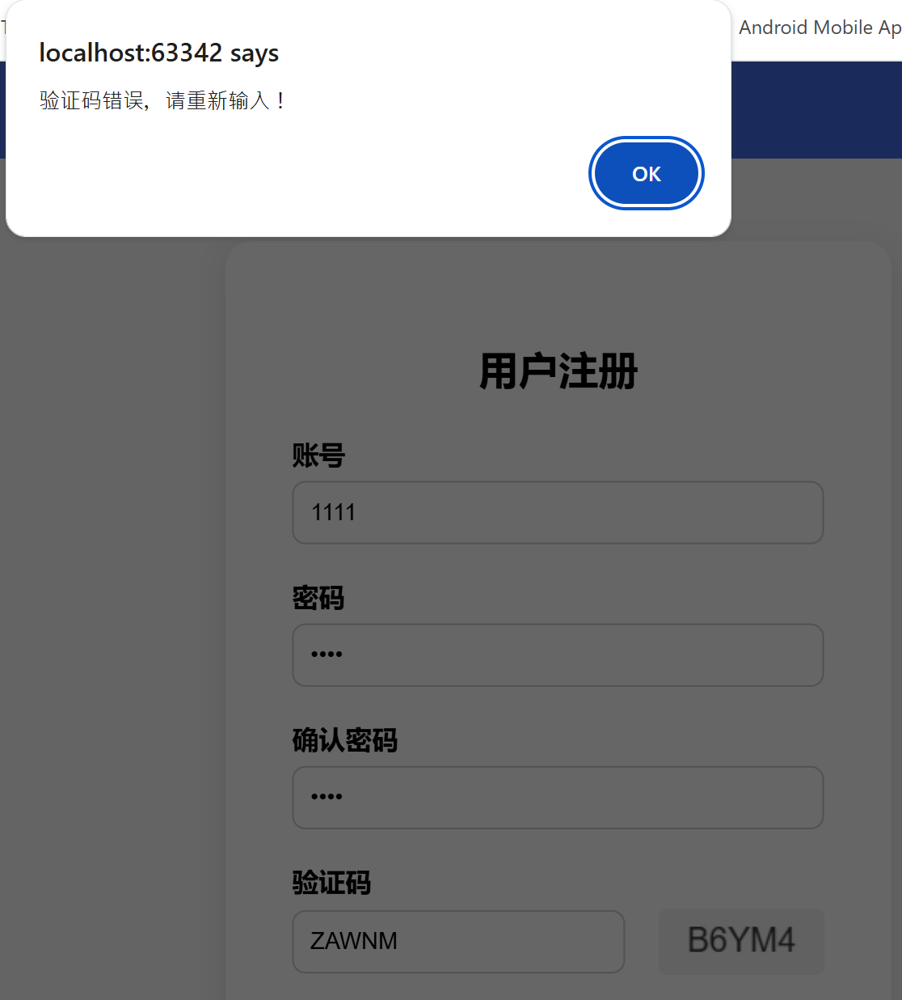

## 界面设计

### 卡片

本项目的核心设计为“卡片”。所有的界面都有卡片。卡片适配亮色和暗色主题，在部分卡片右下角用少量文字加以装饰。卡片有设置圆角，在各个主题下周围有加光效。所有卡片在点按（触摸屏）或者有光标在上面时，会触发动效。绝大部分卡片设置了进场动画。

视频出现问题。

### 图片轮播

在主页和中国商飞界面加入图片轮播，每5000ms切换，样式选用`slide`。右下角有两个按钮，分别控制播放/暂停和下载照片。按钮图标引用Google。

视频无法播放。

### 模态框

点按波音、空客、机场的卡片会弹出模态框。模态框采用大卡片，周围有光效。卡片外区域采用模糊设计。单击模糊区域或者按`Esc`可以退出模态框。

### 飞机动画

飞机动画采用Emoji进行展示。如果浏览器过老可能会无法正常显示。

视频无法播放。

